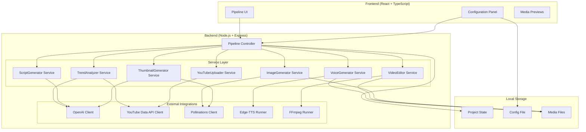
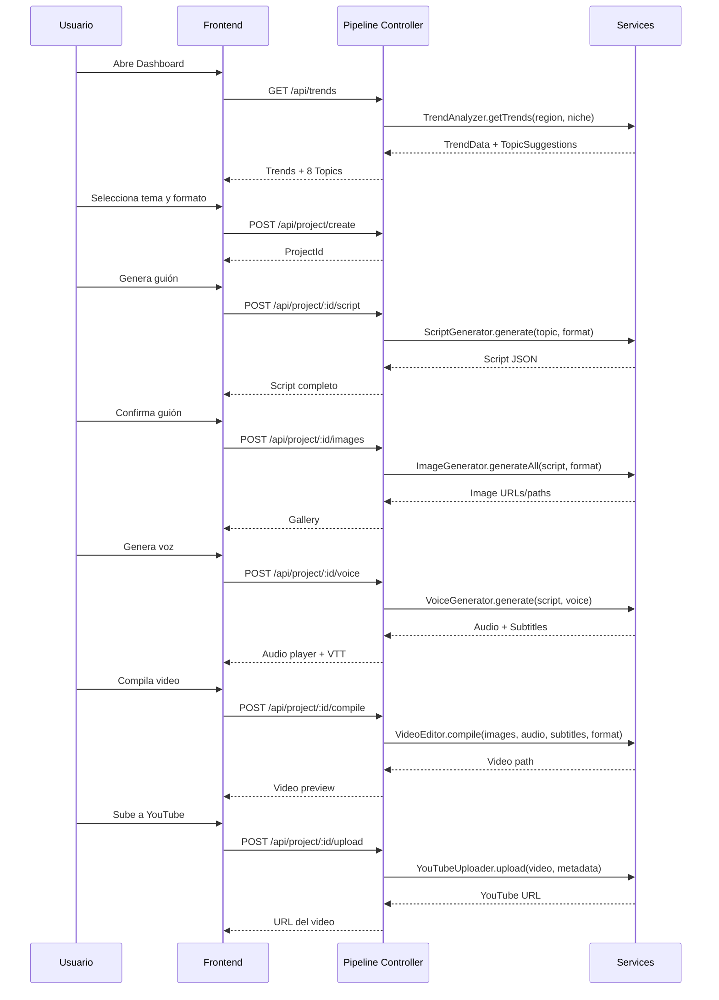

# Design Document: YouTube Video Automation

## Overview

La plataforma YouTube Video Automation es una aplicación web en TypeScript que reemplaza los workflows de n8n existentes con una interfaz visual de pipeline para la creación automatizada de videos. La arquitectura sigue un patrón modular donde cada etapa del pipeline (tendencias, guión, imágenes, voz, video, miniatura, subida) es un servicio independiente orquestado por un controlador de pipeline central.

La aplicación se construirá como una SPA (Single Page Application) con un backend Node.js/Express que maneja las integraciones con APIs externas y la ejecución de procesos locales (edge-tts, FFmpeg).

### Decisiones de Diseño Clave

1. **Arquitectura cliente-servidor**: El frontend maneja la UI del pipeline y el backend orquesta las llamadas a APIs externas y procesos locales, evitando exponer API keys en el cliente.
2. **Pipeline secuencial con estado**: Cada etapa produce artefactos que alimentan la siguiente. El estado del proyecto se persiste localmente para recuperación ante fallos.
3. **Servicios desacoplados**: Cada módulo (TrendAnalyzer, ScriptGenerator, etc.) expone una interfaz común que facilita testing y reemplazo.
4. **Procesamiento local para multimedia**: edge-tts y FFmpeg se ejecutan como procesos hijo en el servidor, manteniendo el costo en cero para generación de voz y compilación de video.

## Architecture



### Flujo de Datos del Pipeline



## Components and Interfaces

### Service Interfaces

```typescript
// Tipos base compartidos
type VideoFormat = 'short' | 'long_video';
type Region = string; // ISO country code (e.g., 'MX', 'ES', 'US')
type PipelineStage = 
  | 'trend_analysis' 
  | 'format_selection' 
  | 'script_generation' 
  | 'image_generation' 
  | 'voice_generation' 
  | 'video_compilation' 
  | 'thumbnail_generation' 
  | 'upload';

type StageStatus = 'pending' | 'in_progress' | 'completed' | 'error';

// ─── TrendAnalyzer Service ───────────────────────────────────────────

interface TrendVideo {
  videoId: string;
  title: string;
  channelTitle: string;
  viewCount: number;
  publishedAt: string;
  thumbnailUrl: string;
}

interface TopicSuggestion {
  title: string;
  description: string;       // max 200 chars
  tags: string[];            // max 10
  viralScore: number;        // 1-10
  recommendedFormat: VideoFormat;
  reasoning: string;         // max 300 chars
}

interface ITrendAnalyzer {
  getPopularVideos(region: Region): Promise<TrendVideo[]>;
  getVideosByNiche(niche: string, region: Region): Promise<TrendVideo[]>;
  getRecentVideosByNiche(niche: string, region: Region): Promise<TrendVideo[]>;
  generateTopicSuggestions(trends: TrendVideo[]): Promise<TopicSuggestion[]>;
}

// ─── ScriptGenerator Service ─────────────────────────────────────────

interface ScriptSection {
  number: number;
  title: string;
  narration: string;
  visualDescription: string;
}

interface Script {
  hook: string;
  introduction: string;
  sections: ScriptSection[];
  closingCTA: string;
  format: VideoFormat;
  totalWordCount: number;
}

interface IScriptGenerator {
  generate(topic: TopicSuggestion, format: VideoFormat): Promise<Script>;
}

// ─── ImageGenerator Service ──────────────────────────────────────────

interface GeneratedImage {
  sectionNumber: number;
  imageUrl: string;
  localPath: string;
  prompt: string;
}

interface IImageGenerator {
  generateForSection(
    visualDescription: string, 
    sectionNumber: number, 
    format: VideoFormat
  ): Promise<GeneratedImage>;
  
  generateAll(script: Script): Promise<GeneratedImage[]>;
  
  regenerate(
    sectionNumber: number, 
    newPrompt: string, 
    format: VideoFormat
  ): Promise<GeneratedImage>;
}

// ─── VoiceGenerator Service ──────────────────────────────────────────

interface VoiceOption {
  id: string;
  name: string;
  language: string;
  gender: string;
}

interface VoiceResult {
  audioPath: string;
  subtitlePath: string;  // VTT format
  durationSeconds: number;
}

interface IVoiceGenerator {
  getAvailableVoices(language: string): Promise<VoiceOption[]>;
  generate(script: Script, voiceId: string): Promise<VoiceResult>;
}

// ─── VideoEditor Service ─────────────────────────────────────────────

interface CompilationInputs {
  images: GeneratedImage[];
  audioPath: string;
  subtitlePath: string;
  format: VideoFormat;
}

interface CompilationResult {
  videoPath: string;
  durationSeconds: number;
  fileSize: number;
}

interface IVideoEditor {
  validateInputs(inputs: CompilationInputs): ValidationResult;
  compile(inputs: CompilationInputs, onProgress?: (percent: number) => void): Promise<CompilationResult>;
}

interface ValidationResult {
  valid: boolean;
  missingInputs: string[];
}

// ─── ThumbnailGenerator Service ──────────────────────────────────────

interface ThumbnailResult {
  imagePath: string;
  prompt: string;
  suggestedOverlayText: string[]; // max 4 words
}

interface IThumbnailGenerator {
  generate(title: string, topic: TopicSuggestion): Promise<ThumbnailResult>;
  regenerate(adjustedPrompt: string): Promise<ThumbnailResult>;
}

// ─── YouTubeUploader Service ─────────────────────────────────────────

type PrivacyStatus = 'public' | 'unlisted' | 'private';

interface UploadMetadata {
  title: string;           // max 100 chars
  description: string;     // max 5000 chars
  tags: string[];          // max 500 chars total
  privacyStatus: PrivacyStatus;
  thumbnailPath: string;
}

interface UploadResult {
  videoUrl: string;
  videoId: string;
}

interface IYouTubeUploader {
  authenticate(): Promise<void>;
  upload(
    videoPath: string, 
    metadata: UploadMetadata, 
    onProgress?: (percent: number) => void
  ): Promise<UploadResult>;
}

// ─── Pipeline Controller ─────────────────────────────────────────────

interface PipelineState {
  projectId: string;
  currentStage: PipelineStage;
  stages: Record<PipelineStage, StageStatus>;
  topic?: TopicSuggestion;
  format?: VideoFormat;
  script?: Script;
  images?: GeneratedImage[];
  voice?: VoiceResult;
  video?: CompilationResult;
  thumbnail?: ThumbnailResult;
  uploadResult?: UploadResult;
}

interface IPipelineController {
  createProject(topic: TopicSuggestion, format: VideoFormat): Promise<PipelineState>;
  getState(projectId: string): Promise<PipelineState>;
  executeStage(projectId: string, stage: PipelineStage): Promise<PipelineState>;
  retryStage(projectId: string, stage: PipelineStage): Promise<PipelineState>;
}
```

### API Endpoints

| Method | Endpoint | Description |
|--------|----------|-------------|
| GET | `/api/trends/:region` | Obtiene videos populares por región |
| GET | `/api/trends/:region/:niche` | Obtiene videos por nicho |
| POST | `/api/trends/suggestions` | Genera 8 sugerencias de temas con OpenAI |
| POST | `/api/project` | Crea nuevo proyecto con tema y formato |
| GET | `/api/project/:id` | Obtiene estado del pipeline |
| POST | `/api/project/:id/script` | Genera guión |
| PUT | `/api/project/:id/script` | Guarda ediciones del guión |
| POST | `/api/project/:id/images` | Genera todas las imágenes |
| POST | `/api/project/:id/images/:section/regenerate` | Regenera imagen de una sección |
| GET | `/api/voices/:language` | Lista voces disponibles |
| POST | `/api/project/:id/voice` | Genera narración y subtítulos |
| POST | `/api/project/:id/compile` | Compila video final |
| POST | `/api/project/:id/thumbnail` | Genera miniatura |
| POST | `/api/project/:id/thumbnail/regenerate` | Regenera miniatura |
| POST | `/api/project/:id/upload` | Sube a YouTube |
| GET | `/api/config` | Obtiene configuración |
| PUT | `/api/config` | Guarda configuración |
| POST | `/api/config/validate-keys` | Valida API keys |

## Data Models

### Project State (almacenado en disco como JSON)

```typescript
interface ProjectState {
  id: string;                    // UUID
  createdAt: string;             // ISO timestamp
  updatedAt: string;             // ISO timestamp
  topic: TopicSuggestion;
  format: VideoFormat;
  pipeline: PipelineState;
  
  // Artefactos por etapa
  script?: Script;
  images?: GeneratedImage[];
  voice?: VoiceResult;
  video?: CompilationResult;
  thumbnail?: ThumbnailResult;
  upload?: UploadResult;
}
```

### Configuration (almacenado en disco como JSON)

```typescript
interface AppConfig {
  apiKeys: {
    openai: string;
    youtube: string;
  };
  defaults: {
    region: Region;            // default: 'MX'
    niche?: string;
    voice?: string;
    format?: VideoFormat;
  };
  paths: {
    outputDir: string;         // directorio de salida para videos
    tempDir: string;           // directorio temporal para procesamiento
  };
}
```

### Script Structure (formato JSON del guión)

```typescript
interface Script {
  hook: string;                  // Frase de enganche inicial
  introduction: string;          // Introducción al tema
  sections: ScriptSection[];     // 3 secciones (Short) o 8-12 (Long_Video)
  closingCTA: string;           // Llamada a la acción final
  format: VideoFormat;
  totalWordCount: number;
  metadata: {
    topic: string;
    generatedAt: string;
    language: string;            // default: 'es'
  };
}

interface ScriptSection {
  number: number;
  title: string;
  narration: string;
  visualDescription: string;
}
```

### Trending Data Cache

```typescript
interface TrendCache {
  region: Region;
  niche?: string;
  fetchedAt: string;            // ISO timestamp
  expiresAt: string;            // fetchedAt + 1 hour
  videos: TrendVideo[];
  suggestions?: TopicSuggestion[];
}
```


## Correctness Properties

*A property is a characteristic or behavior that should hold true across all valid executions of a system—essentially, a formal statement about what the system should do. Properties serve as the bridge between human-readable specifications and machine-verifiable correctness guarantees.*

### Property 1: Topic suggestions are sorted and capped

*For any* set of trending videos processed by the topic suggestion logic, the output SHALL contain exactly 8 suggestions sorted by viralScore in descending order (each element's viralScore >= next element's viralScore).

**Validates: Requirements 1.4**

### Property 2: Topic suggestion field constraints

*For any* TopicSuggestion object that passes validation, the description SHALL have at most 200 characters, tags SHALL have at most 10 elements, viralScore SHALL be between 1 and 10 inclusive, recommendedFormat SHALL be either "short" or "long_video", and reasoning SHALL have at most 300 characters.

**Validates: Requirements 1.5**

### Property 3: Script format constraints

*For any* valid Script object, if the format is "long_video" then the section count SHALL be between 8 and 12 inclusive and the total narration word count SHALL be between 1,500 and 2,250 inclusive; if the format is "short" then the section count SHALL be exactly 3 and the total narration word count SHALL be between 110 and 150 inclusive.

**Validates: Requirements 3.2, 3.3**

### Property 4: Script structural completeness

*For any* valid Script object, it SHALL have a non-empty hook, a non-empty introduction, at least one section (each with non-empty title, narration, and visualDescription), and a non-empty closingCTA.

**Validates: Requirements 3.4**

### Property 5: Image generation retry bound

*For any* image generation attempt that fails, the retry mechanism SHALL attempt at most 3 additional requests with a 5-second delay between each, and the total number of attempts for a single image SHALL never exceed 4 (1 original + 3 retries).

**Validates: Requirements 4.6**

### Property 6: Narration concatenation preserves section order

*For any* Script with N sections, the concatenated narration text SHALL contain each section's narration as a substring, and for any two sections i < j, section i's narration SHALL appear before section j's narration in the concatenated output.

**Validates: Requirements 5.1**

### Property 7: Voice filter returns only matching languages

*For any* region and list of available voices, the filtered voice list SHALL contain only voices whose language matches the region's configured language, and SHALL contain all voices from the source list that match that language.

**Validates: Requirements 5.3**

### Property 8: Compilation input validation identifies missing inputs

*For any* CompilationInputs object, the validation result SHALL report valid=true if and only if there is at least one image, one audio file path, and one subtitle file path; otherwise it SHALL report valid=false and missingInputs SHALL list exactly the categories of inputs that are absent.

**Validates: Requirements 6.1, 6.2**

### Property 9: Image time distribution is uniform and covers audio

*For any* positive audio duration D and positive image count N, each image SHALL display for exactly D/N seconds, and the sum of all image display durations SHALL equal D (within floating-point tolerance of 0.001 seconds).

**Validates: Requirements 6.5**

### Property 10: Thumbnail overlay text word limit

*For any* video title and topic used to generate overlay text suggestions, the suggested text SHALL contain at most 4 words.

**Validates: Requirements 7.6**

### Property 11: Upload metadata validation enforces character limits

*For any* UploadMetadata object that passes validation, title SHALL have at most 100 characters, description SHALL have at most 5000 characters, and the total character count of all tags joined SHALL be at most 500 characters.

**Validates: Requirements 8.2**

### Property 12: Upload retry follows exponential backoff

*For any* sequence of upload network failures, the retry mechanism SHALL attempt at most 3 retries with delays of 2s, 4s, and 8s respectively, and SHALL not initiate a 4th retry.

**Validates: Requirements 8.8**

### Property 13: Video format validation

*For any* file path, the format validator SHALL accept only YouTube-supported formats (MP4, MOV, AVI, WMV, FLV, WebM, 3GP) and SHALL reject all other extensions without initiating upload.

**Validates: Requirements 8.9**

### Property 14: Configuration persistence round-trip

*For any* valid AppConfig object, saving the configuration to disk and then loading it SHALL produce an object equal to the original.

**Validates: Requirements 9.2**

### Property 15: Pipeline stage accessibility invariant

*For any* PipelineState, a stage SHALL be accessible (navigable or executable) if and only if all preceding stages have status "completed"; a stage with status "in_progress" SHALL cause all subsequent stages to be disabled; and all stages with status "completed" SHALL be navigable for review.

**Validates: Requirements 10.2, 10.3, 10.4**

### Property 16: Failed stage preserves previous data

*For any* PipelineState where a stage has status "error", all data produced by stages prior to the failed stage SHALL remain unchanged and accessible.

**Validates: Requirements 10.5**

## Error Handling

### Strategy General

Todos los errores se clasifican en tres categorías:

1. **Errores de API externa** (YouTube, OpenAI, Pollinations): Se muestran al usuario con un mensaje descriptivo y opción de reintentar. Los datos previos se preservan.
2. **Errores de proceso local** (edge-tts, FFmpeg): Se captura stderr del proceso, se presenta al usuario con contexto, y se ofrece reintentar.
3. **Errores de validación**: Se previenen antes de ejecutar operaciones costosas, mostrando qué campos o inputs faltan.

### Patrones de Retry

| Servicio | Max Retries | Estrategia | Delay |
|----------|-------------|------------|-------|
| Pollinations (imágenes) | 3 | Lineal | 5s entre intentos |
| YouTube Upload | 3 | Exponencial | 2s, 4s, 8s |
| OpenAI | 0 | Sin retry automático | Usuario decide |
| edge-tts | 0 | Sin retry automático | Usuario decide |
| FFmpeg | 0 | Sin retry automático | Usuario decide |

### Timeouts

| Operación | Timeout | Acción |
|-----------|---------|--------|
| OpenAI (script/suggestions) | 60s | Cancelar y mostrar error |
| Pollinations (por imagen) | 60s | Iniciar retry |
| YouTube OAuth | 60s | Mostrar error de timeout |
| YouTube Upload | Sin timeout (progress tracking) | — |
| edge-tts | Sin timeout explícito | Monitoreo de proceso |
| FFmpeg | Sin timeout explícito | Monitoreo de progreso |

### Preservación de Estado ante Errores

- Los errores en cualquier etapa NO afectan los artefactos de etapas previas
- El pipeline permite reintentar la etapa fallida sin perder datos
- Si OpenAI falla durante sugerencias de temas, los datos de tendencias de YouTube se preservan
- Si una imagen individual falla, las demás imágenes generadas se preservan

### Manejo de Errores por Componente

```typescript
// Error base para la aplicación
interface AppError {
  code: string;
  message: string;
  service: string;
  retryable: boolean;
  details?: Record<string, unknown>;
}

// Códigos de error por servicio
enum ErrorCode {
  // YouTube API
  YOUTUBE_API_ERROR = 'YOUTUBE_API_ERROR',
  YOUTUBE_AUTH_ERROR = 'YOUTUBE_AUTH_ERROR',
  YOUTUBE_AUTH_TIMEOUT = 'YOUTUBE_AUTH_TIMEOUT',
  YOUTUBE_UPLOAD_FAILED = 'YOUTUBE_UPLOAD_FAILED',
  YOUTUBE_UNSUPPORTED_FORMAT = 'YOUTUBE_UNSUPPORTED_FORMAT',
  
  // OpenAI
  OPENAI_API_ERROR = 'OPENAI_API_ERROR',
  OPENAI_TIMEOUT = 'OPENAI_TIMEOUT',
  
  // Pollinations
  POLLINATIONS_GENERATION_FAILED = 'POLLINATIONS_GENERATION_FAILED',
  POLLINATIONS_TIMEOUT = 'POLLINATIONS_TIMEOUT',
  
  // edge-tts
  TTS_PROCESS_ERROR = 'TTS_PROCESS_ERROR',
  
  // FFmpeg
  FFMPEG_PROCESS_ERROR = 'FFMPEG_PROCESS_ERROR',
  
  // Validation
  VALIDATION_MISSING_INPUTS = 'VALIDATION_MISSING_INPUTS',
  VALIDATION_INVALID_API_KEY = 'VALIDATION_INVALID_API_KEY',
  VALIDATION_INVALID_METADATA = 'VALIDATION_INVALID_METADATA',
}
```

## Testing Strategy

### Enfoque Dual de Testing

La plataforma utiliza un enfoque combinado de tests unitarios (ejemplos específicos) y tests basados en propiedades (verificación universal):

#### Property-Based Tests (fast-check)

Se utiliza la librería **fast-check** para TypeScript/JavaScript. Cada property test ejecuta un mínimo de 100 iteraciones con inputs generados aleatoriamente.

**Configuración:**
- Librería: `fast-check` (npm)
- Iteraciones mínimas: 100 por propiedad
- Cada test referencia su propiedad del diseño con el formato de tag:
  `// Feature: youtube-video-automation, Property {N}: {título}`

**Properties a implementar:**
1. Topic suggestions sorted and capped (Property 1)
2. Topic suggestion field constraints (Property 2)
3. Script format constraints (Property 3)
4. Script structural completeness (Property 4)
5. Image retry bound (Property 5)
6. Narration concatenation order (Property 6)
7. Voice filter matching (Property 7)
8. Compilation input validation (Property 8)
9. Image time distribution (Property 9)
10. Overlay text word limit (Property 10)
11. Upload metadata validation (Property 11)
12. Upload retry exponential backoff (Property 12)
13. Video format validation (Property 13)
14. Configuration round-trip (Property 14)
15. Pipeline stage accessibility (Property 15)
16. Failed stage data preservation (Property 16)

#### Unit Tests (Vitest)

Tests unitarios para ejemplos específicos, edge cases, y verificaciones de integración con mocks:

- **Ejemplos específicos**: Formato de comandos FFmpeg, parámetros de requests a APIs, valores default
- **Edge cases**: Timeouts, errores de red, API keys inválidas, inputs vacíos
- **Integration tests (con mocks)**: Flujo completo del pipeline con servicios mockeados

#### Test Runner

- **Framework**: Vitest
- **PBT Library**: fast-check
- **Mocking**: Vitest built-in mocks para APIs externas y procesos

### Cobertura por Componente

| Componente | Property Tests | Unit Tests | Integration Tests |
|------------|---------------|------------|-------------------|
| TrendAnalyzer | Props 1, 2 | API params, error handling | Flujo con mock YouTube/OpenAI |
| ScriptGenerator | Props 3, 4 | Prompt construction, timeout | Flujo con mock OpenAI |
| ImageGenerator | Prop 5 | Resolution params, gallery state | Flujo con mock Pollinations |
| VoiceGenerator | Props 6, 7 | Voice list, audio params | Flujo con mock edge-tts |
| VideoEditor | Props 8, 9 | FFmpeg commands, subtitle params | Compilación con archivos reales |
| ThumbnailGenerator | Prop 10 | Prompt no-text constraint | Flujo con mock Pollinations |
| YouTubeUploader | Props 11, 12, 13 | OAuth flow, privacy defaults | Upload con mock API |
| ConfigManager | Prop 14 | Key validation, defaults | Persistencia real en disco |
| PipelineController | Props 15, 16 | Stage transitions, retry | Flujo completo mockeado |
